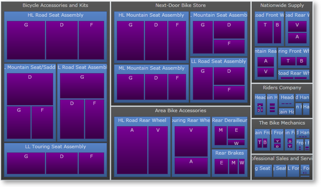
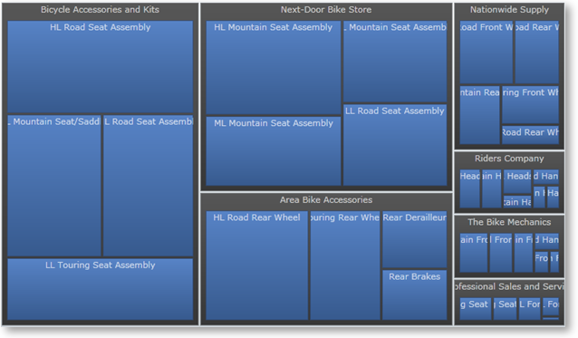
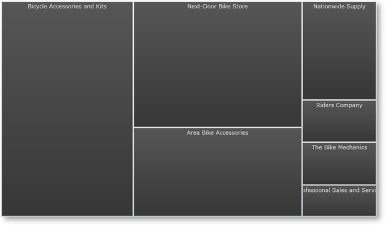

////

|metadata|
{
    "name": "xamtreemap-showing-depth",
    "controlName": ["xamTreemap"],
    "tags": ["How Do I"],
    "guid": "aaaf5c11-1f88-4f38-b688-339f3cabfa34",  
    "buildFlags": [],
    "createdOn": "2016-05-25T18:21:59.8104191Z"
}
|metadata|
////

= Showing Depth

The xamTreemap™ control’s link:{ApiPlatform}controls.charts.xamtreemap{ApiVersion}~infragistics.controls.charts.xamtreemap~showingdepth.html[ShowingDepth] property allows the end user to set the maximum depth of the hierarchy at which the items will be displayed.

*In XAML:*

----
<ig:xamTreemap x:Name="Treemap" ShowingDepth="3" >
----

*In XAML:*

----
<ig:xamTreemap x:Name="Treemap" ShowingDepth="2" >
----

*In XAML:*

----
<ig:xamTreemap x:Name="Treemap" ShowingDepth="1" >
----

== Actual Showing Depth

The xamTreemap control’s link:{ApiPlatform}controls.charts.xamtreemap{ApiVersion}~infragistics.controls.charts.xamtreemap~actualshowingdepth.html[ActualShowingDepth] property specifies the maximum hierarchy level that is actually displayed. In the case when a custom ShowingDepth is set, the ActualShowingDepth is always lower or equal to the ShowingDepth.

If you have a two-level hierarchical data source assigned to the and if you set the ShowingDepth property value to 5, the ActualShowingDepth property value will be 2.