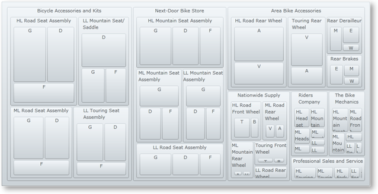
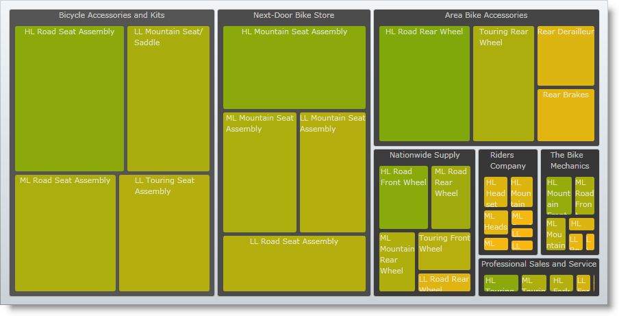

////

|metadata|
{
    "name": "xamtreemap-understanding-xamtreemap",
    "controlName": ["xamTreemap"],
    "tags": ["Charting","Getting Started","Summaries"],
    "guid": "9f2009f9-0e08-436f-982c-61375cdc6edb",  
    "buildFlags": [],
    "createdOn": "2016-05-25T18:21:59.739375Z"
}
|metadata|
////

= Understanding xamTreemap

In this section you’ll find information that will help you to better understand the features of the link:{ApiPlatform}controls.charts.xamtreemap{ApiVersion}~infragistics.controls.charts.xamtreemap.html[xamTreemap]™ control, as well as details about the Node Binders and Value Mappers.

link:xamtreemap-about-node-binding.html[About xamTreemap Node Binding]

In this topic you will learn how the xamTreemap control uses Node Binders in order to bind data.

link:xamtreemap-about-value-mapping.html[About xamTreemap Value Mapping]

This topic will introduce to you the Value Mapping capabilities of the xamTreemap control.

== Related Topics

link:xamtreemap-getting-started-with-xamtreemap.html[Getting Started with xamTreemap]

link:xamtreemap-using-xamtreemap.html[Using xamTreemap]

link:xamtreemap-api-overview.html[API Overview]