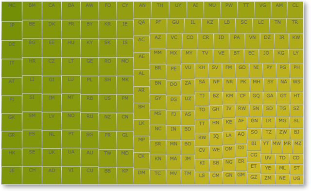

////

|metadata|
{
    "name": "xamtreemap",
    "controlName": ["xamTreemap"],
    "tags": ["Getting Started"],
    "guid": "258e0bea-5500-4e8e-a3ad-0e941a039455",  
    "buildFlags": [],
    "createdOn": "2016-05-25T18:21:59.9113933Z"
}
|metadata|
////

= xamTreemap

This section gives you an overview of the use of the link:{ApiPlatform}controls.charts.xamtreemap{ApiVersion}~infragistics.controls.charts.xamtreemap.html[xamTreemap]™ control. It contains information ranging from what the control does to the step-by-step procedures on how to accomplish common tasks using the control.

Click the links below to access important information about the xamTreemap control.

== link:xamtreemap-understanding-xamtreemap.html[Understanding xamTreemap]

Treemaps display hierarchical (tree-structured) data as a set of nested nodes. Each branch of the tree is given a treemap node, which is then tiled with smaller nodes representing sub-branches. Each node's rectangle has an area proportional to a specified dimension on the data. Often the nodes are colored to show a separate dimension of the data.

When the color and size dimensions are correlated in some way with the tree structure, one can often easily see patterns that would be difficult to spot in other ways. A second advantage of treemaps is that, by construction, they make efficient use of space. As a result, they can legibly display thousands of items on the screen simultaneously.

Treemaps are not designed to convey numerical quantities; the intent is to show relative rankings. Treemaps can be more effective than pie charts and other forms of area charts that often do a poor job of classifying data points and communicating the relative differences of their values.

The xamTreemap control is a treemap that displays the relative weight of data. It uses a variety of algorithms to help it determine how the layout of its data items should occur:

* Slice and Dice
* Squarified
* Strip

The xamTreemap control allows customers to choose the algorithm that is best for their requirements, defaulting to use the Squarified method. The control includes the ability to allow customers to colorize nodes using two mechanisms, first a group-based meachism that colors items with like values, second a scale-based mechanism similar to a map choropleth, which gradiates node colors based on their value.

The control is capable of binding to and rendering tens of thousands of data point nodes.

== link:xamtreemap-getting-started-with-xamtreemap.html[Getting Started with xamTreemap]

In order to get you up and running as quickly as possible with the xamTreemap control, we've provided you with information on how to get started using the control.

== link:xamtreemap-using-xamtreemap.html[Using xamTreemap]

This section contains information on the key features and functionalities provided by the xamTreemap control.

== link:xamtreemap-api-overview.html[API Overview]

This topic lists the namespaces and classes that you will be working with while programming with the xamTreemap control. The namespaces and classes listed in this topic link conveniently into the link:api-reference-guide.html[API Reference Guide] section of the {ProductName} help.