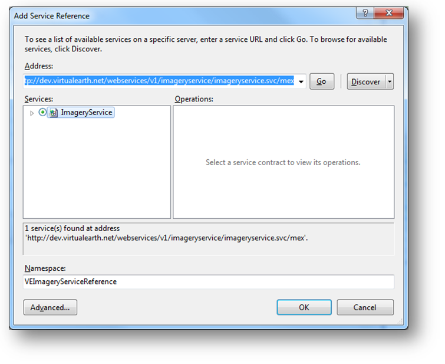

////

|metadata|
{
    "name": "xamwebmap-add-bing-maps-as-geo-imagery-data-source",
    "controlName": ["xamMap"],
    "tags": ["Application Scenarios","How Do I"],
    "guid": "{F0CD73AC-9D32-45AE-9690-BE543DB92600}",  
    "buildFlags": [],
    "createdOn": "2016-05-25T18:21:57.0662629Z"
}
|metadata|
////

= Binding Bing Maps

== Before You Begin

The xamMap™ control supports a number of geo-imagery sources which are listed in the link:xamwebmap-supported-geo-imagery.html[Supported Geo-Imagery] section. This topic will focus only on using Bing Maps as the geo-imagery data source. The link:{ApiPlatform}controls.maps.xammap{ApiVersion}~infragistics.controls.maps.xammap.html[xamMap] control’s link:{ApiPlatform}controls.maps.xammap{ApiVersion}~infragistics.controls.maps.xammap~maptilesource.html[MapTileSource] property is used with the Microsoft’s Bing Maps imagery service to acquire geo-imagery data. Because the Bing Maps is a licensed web mapping service from Microsoft, you will need to get your own key for Bing Maps Key from Microsoft’s link:http://www.bingmapsportal.com[website] before you can continue following steps in this topic.

== What You Will Accomplish

You will add Bing Maps geo-imagery as the data source to the link:{ApiPlatform}controls.maps.xammap{ApiVersion}~infragistics.controls.maps.xammap.html[xamMap] control and initialize the control’s window map coordinates.

== Follow These Steps

The following set of instructions assumes that you have already set up your project for the xamMap control and that you have your own key for Bing Maps imagery service.

[start=1]
. Create a Microsoft® {PlatformName}® project.
[start=2]
. In the Solution Explorer, add the following reference to your project:

** {ApiPlatform}Controls.Maps.XamMap.{DllVersion}dll
** {ApiPlatform}DataVisualization.{DllVersion}dll
** {ApiPlatform}{DllVersion}dll

[start=3]
. Add the following namespaces declaration for the xamMap control.

*In XAML:*

----
xmlns:ig="http://schemas.infragistics.com/xaml"
----

*In Visual Basic:*

----
Imports Infragistics.Controls.Maps
Imports Infragistics
----

*In C#:*

----
using Infragistics.Controls.Maps;
using Infragistics;
----

[start=4]
. Add the xamMap control to your main XAML file:

*In XAML:*

----
<ig:XamMap x:Name="igMap">
<!-- NOTE: You can add more Map Layer objects here, e.g. with Shapefile -->
</ig:XamMap>
----

Note: The following steps are necessary to set up the xamMap control to receive geo-imagery map tiles from the Bing Maps imagery service.
[start=5]
. Right-click on your application project and select the *Add Service Reference* menu item.

ifdef::sl[]
[start=6]
. Enter the following address in the Address textbox and click on the Go button:

link:http://dev.virtualearth.net/webservices/v1/imageryservice/imageryservice.svc/mex[http://dev.virtualearth.net/webservices/v1/imageryservice/imageryservice.svc/mex]

[start=7]
. Select the *ImageryService* item in the Services list box.

[start=8]
. Enter *BingImageryServiceReference* in the Namespace textbox and click on the OK button.

endif::sl[]

ifdef::wpf[]
[start=6]
. Click on the *Advanced…* button in *Add Service Reference* window.

[start=7]
. Check “Generate asynchronous operations” in the Client section of the *Service Reference Settings* window.

[start=8]
. Click on the *Add Web Reference…* button in *Service Reference Settings* window.

[start=9]
. Enter the following address in the URL textbox and click on the Go button:

link:http://dev.virtualearth.net/webservices/v1/imageryservice/imageryservice.svc/mex[http://dev.virtualearth.net/webservices/v1/imageryservice/imageryservice.svc/mex]

[start=10]
. Enter *BingImageryServiceReference* in the Web Reference Name textbox and click on the Add Reference button.

endif::wpf[]

[start=11]
. In the constructor of UserControl, add handler for the UserControl's Loaded event and implement it.

*In Visual Basic:*

----
Private Sub UserControl_Loaded(ByVal sender As System.Object, ByVal e As System.Windows.RoutedEventArgs)
        InitImageryService()
        InitMapCoordinates()
End Sub
----

*In C#:*

----
private void UserControl_Loaded(object sender, RoutedEventArgs e)
{
        InitImageryService();
        InitMapCoordinates();
}
----

[start=12]
. Add the following method that will initialize the Bing Maps imagery service to request geo-imagery map data.

*In Visual Basic:*

----
Private Sub InitImageryService()
        Dim mapImgRequest As New BingImageryServiceReference.ImageryMetadataRequest()
        ' NOTE: You need provide your own key for Bing Maps
        mapImgRequest.Credentials = New BingImageryServiceReference.Credentials()
        mapImgRequest.Credentials.ApplicationId = "BING_MAPS_SECRET_KEY"
        mapImgRequest.Style = BingImageryServiceReference.MapStyle.AerialWithLabels
        ' create asynchronous Bing Maps service to handle geo-imagery requests
        Dim imgService As New BingImageryServiceReference.ImageryServiceClient("BasicHttpBinding_IImageryService")
        AddHandler imgService.GetImageryMetadataCompleted, AddressOf OnImageryServiceGetImageryMetadataCompleted
        imgService.GetImageryMetadataAsync(mapUriRequest)
End Sub
----

*In C#:*

----
private void InitImageryService()
{
    BingImageryServiceReference.ImageryMetadataRequest mapImgRequest = new BingImageryServiceReference.ImageryMetadataRequest();
    // NOTE: You need provide your own key for Bing Maps
    mapImgRequest.Credentials = new BingImageryServiceReference.Credentials();
    mapImgRequest.Credentials.ApplicationId = "BING_MAPS_SECRET_KEY";
    mapImgRequest.Style = BingImageryServiceReference.MapStyle.AerialWithLabels;
    // create asynchronous Bing Maps service to handle geo-imagery requests
    BingImageryServiceReference.ImageryServiceClient imgService = new BingImageryServiceReference.ImageryServiceClient("BasicHttpBinding_IImageryService");
    imgService.GetImageryMetadataCompleted += OnImageryServiceGetImageryMetadataCompleted;
    imgService.GetImageryMetadataAsync(mapImgRequest);
}
----

[start=13]
. Add the following method to handle geo-imagery requests and to display geo-imagery on the xamMap control.

*In Visual Basic:*

----
Private Sub OnImageryServiceGetImageryMetadataCompleted(ByVal sender As Object, ByVal e As BingImageryServiceReference.GetImageryMetadataCompletedEventArgs)
        Dim result As BingImageryServiceReference.ImageryMetadataResult = e.Result.Results(0)
        Dim source As New Infragistics.Controls.Maps.BingMapsTileSource()
        source.TilePath = result.ImageUri
        source.SubDomains = New ObservableCollection(Of String)(result.ImageUriSubdomains)
        igMap.MapTileSource = source
End Sub
----

*In C#:*

----
private void OnImageryServiceGetImageryMetadataCompleted(object sender, BingImageryServiceReference.GetImageryMetadataCompletedEventArgs e)
{
        BingImageryServiceReference.ImageryMetadataResult result = e.Result.Results[0];
        igMap.MapTileSource = newInfragistics.Controls.Maps.BingMapsTileSource()
        {
                TilePath = result.ImageUri,
                SubDomains = new ObservableCollection<string>(result.ImageUriSubdomains)
        };
}
----

[start=14]
. Add the following method to initialize the xamMap control's world map coordinates.

*In Visual Basic:*

----
Private Sub InitMapCoordinates()
        ' define world dimensions
        Dim worldTopLeft As Point = New Point(-180, 90)
        Dim worldBottomRight As Point = New Point(180, -90)
        ' Convert Geodetic to Cartesian coordinates
        Dim winTopLeft As Point = Me.xamMap.MapProjection.ProjectToMap(worldTopLeft)
        Dim winBottomRight As Point = Me.xamMap.MapProjection.ProjectToMap(worldBottomRight)
        ' Create Rect structure the map control's WindowRect and WorldRect
        Dim winRect As New Rect()
        winRect.X = Math.Min(winTopLeft.X, winBottomRight.X)
        winRect.Y = Math.Min(winTopLeft.Y, winBottomRight.Y)
        winRect.Width = Math.Abs(winTopLeft.X - winBottomRight.X)
        winRect.Height = Math.Abs(winTopLeft.Y - winBottomRight.Y)
        Me.igMap.IsAutoWorldRect = False
        Me.igMap.WindowZoomMaximum = 80
        ' Change the map control's WindowRect and WorldRect
        Me.igMap.WorldRect = winRect
        Me.igMap.WindowRect = winRect
End Sub
----

*In C#:*

----
private void InitMapCoordinates()
{
        // define world dimensions 
       Point worldTopLeft = new Point(-180, 90);
       Point worldBottomRight = new Point(180, -90);
       // Convert Geodetic to Cartesian coordinates
       Point winTopLeft = this.igMap.MapProjection.ProjectToMap(worldTopLeft);
       Point winBottomRight = this.igMap.MapProjection.ProjectToMap(worldBottomRight);
       // Create Rect structure the map control's WindowRect and WorldRect
       Rect winRect = new Rect()
       {
        X = Math.Min(winTopLeft.X, winBottomRight.X),
        Y = Math.Min(winTopLeft.Y, winBottomRight.Y),
        Width = Math.Abs(winTopLeft.X - winBottomRight.X),
        Height = Math.Abs(winTopLeft.Y - winBottomRight.Y)
       };
       this.igMap.IsAutoWorldRect = false;
       this.igMap.WindowZoomMaximum = 80;
       // Change the map control's WindowRect and WorldRect
       this.igMap.WindowRect = this.igMap.WorldRect = winRect;
}
----

[start=15]
. Save and run your project. The xamMap control will load and display the geo-imagery data from Bing Maps source. The following screenshot shows the result.

== Related Topics

link:xamwebmap-merge-bing-maps-with-shapefile.html[Merging Bing Maps with Shapefile]

link:xamwebmap-supported-geo-imagery.html[Supported Geo-Imagery]

link:xamwebmap-add-open-street-maps-as-geo-imagery-data-source.html[Binding Open Street Maps]