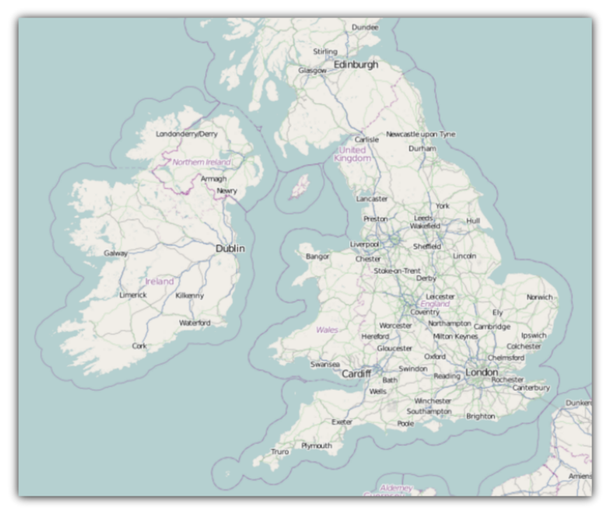

////

|metadata|
{
    "name": "xamwebmap-add-open-street-maps-as-geo-imagery-data-source",
    "controlName": ["xamMap"],
    "tags": ["Application Scenarios","How Do I"],
    "guid": "{48759674-CD48-4BFC-8BF6-B27E2BB99A45}",  
    "buildFlags": [],
    "createdOn": "2016-05-25T18:21:57.0782636Z"
}
|metadata|
////

= Binding Open Street Maps

== Before You Begin

The xamMap™ control’s link:{ApiPlatform}controls.maps.xammap{ApiVersion}~infragistics.controls.maps.xammap~maptilesource.html[MapTileSource] property is used to configure the source from which geo-imagery is loaded. Please refer to the link:xamwebmap-supported-geo-imagery.html[Supported Geo-Imagery] section for a complete list of supported geo-imagery source. However this section will focus only on OpenStreetMap as the geo-imagery source. The Open Street Maps web mapping service is not licensed so you do not provide any license keys for it to work with the xamMap control.

== What You Will Accomplish

You will add Open Street Maps as geo-imagery source to the xamMap control and set its world map coordinates.

== Follow These Steps

The following set of instructions assumes that you have already set up your {PlatformName} project for the xamMap control.

[start=1]
. Create a Microsoft® {PlatformName}® project.
[start=2]
. In the Solution Explorer, add the following reference to your project:

** {ApiPlatform}Controls.Maps.XamMap.{DllVersion}dll
** {ApiPlatform}DataVisualization.{DllVersion}dll
** {ApiPlatform}{DllVersion}dll

[start=3]
. Add the following namespaces declaration for the xamMap control.

*In XAML:*

----
xmlns:igMap="http://schemas.infragistics.com/xaml"
----

*In Visual Basic:*

----
Imports Infragistics.Controls.Maps
Imports Infragistics
----

*In C#:*

----
using Infragistics.Controls.Maps;
using Infragistics;
----

[start=4]
. Add the link:{ApiPlatform}controls.maps.xammap{ApiVersion}~infragistics.controls.maps.xammap.html[XamMap] control with appropriate projection type

*In XAML:*

----
<igMap:XamMap x:Name="xamMap" >
        <!-- TODO: Add Open Street Maps as geo-imagery data source -->
</igMap:XamMap>
----

[start=5]
. Set the MapTileSource property to link:{ApiPlatform}datavisualization{ApiVersion}~infragistics.controls.maps.openstreetmaptilesource.html[OpenStreetMapTileSource].

*In XAML:*

----
<igMap:XamMap.MapTileSource >
      <igMap:OpenStreetMapTileSource/>
</igMap:XamMap.MapTileSource>
----

[start=6]
. In code behind, add event handler for the User Control object's Loaded event.

*In Visual Basic:*

----
Public Sub New()
        InitializeComponent()
        AddHandler Me.Loaded, AddressOf UserControl_Loaded
End Sub
----

*In C#:*

----
public MainPage()
{
      InitializeComponent();
      this.Loaded += new RoutedEventHandler(UserControl_Loaded);
}
----

[start=7]
. Implement the event handler for the UserControl's Loaded event.

*In Visual Basic:*

----
Private Sub UserControl_Loaded(ByVal sender As System.Object, ByVal e As System.Windows.RoutedEventArgs)
        InitMapCoordinates()
End Sub
----

*In C#:*

----
private void UserControl_Loaded(object sender, RoutedEventArgs e)
{
        InitMapCoordinates();
}
----

[start=8]
. Add the following method to initialize the xamMap control's world map coordinates.

*In Visual Basic:*

----
Private Sub InitMapCoordinates()
        ' Convert define world dimensions
        Dim worldTopLeft As Point = New Point(-180, 90)
        Dim worldBottomRight As Point = New Point(180, -90)
        ' Convert Geodetic to Cartesian coordinates
        Dim winTopLeft As Point = Me.xamMap.MapProjection.ProjectToMap(worldTopLeft)
        Dim winBottomRight As Point = Me.xamMap.MapProjection.ProjectToMap(worldBottomRight)
        ' Create Rect structure the map control's WindowRect and WorldRect
        Dim winRect As New Rect()
        winRect.X = Math.Min(winTopLeft.X, winBottomRight.X)
        winRect.Y = Math.Min(winTopLeft.Y, winBottomRight.Y)
        winRect.Width = Math.Abs(winTopLeft.X - winBottomRight.X)
        winRect.Height = Math.Abs(winTopLeft.Y - winBottomRight.Y)
        Me.xamMap.IsAutoWorldRect = False
        Me.xamMap.WindowZoomMaximum = 80
       ' Change the map control's WindowRect and WorldRect
        Me.xamMap.WorldRect = winRect
        Me.xamMap.WindowRect = winRect
End Sub
----

*In C#:*

----
private void InitMapCoordinates()
{
            // define world dimensions 
            Point worldTopLeft = new Point(-180, 90);
            Point worldBottomRight = new Point(180, -90);
            // Convert Geodetic to Cartesian coordinates
            Point winTopLeft = this.xamMap.MapProjection.ProjectToMap(worldTopLeft);
            Point winBottomRight = this.xamMap.MapProjection.ProjectToMap(worldBottomRight);
            // Create Rect structure the map control's WindowRect and WorldRect
            Rect winRect = new Rect()
            {
                X = Math.Min(winTopLeft.X, winBottomRight.X),
                Y = Math.Min(winTopLeft.Y, winBottomRight.Y),
                Width = Math.Abs(winTopLeft.X - winBottomRight.X),
                Height = Math.Abs(winTopLeft.Y - winBottomRight.Y)
            };
            this.xamMap.IsAutoWorldRect = false;
            this.xamMap.WindowZoomMaximum = 80;
            // Change the map control's WindowRect and WorldRect
            this.xamMap.WindowRect = this.xamMap.WorldRect = winRect;
}
----

[start=9]
. Run the application. The xamMap control will load and display the geo-imagery data from Open Street Maps source. The following screenshot shows the result.

== Related Topics

* link:xamwebmap-display-different-layer-types.html[Display Different Layer Types]
* link:xamwebmap-geo-imagery-integration.html[Geo-Imagery Integration]
* link:xamwebmap-merge-bing-maps-with-shapefile.html[Merging Bing Maps with Shapefile]
* link:xamwebmap-merge-open-street-maps-with-shapefile.html[Merging Open Street Maps with Shapefile]