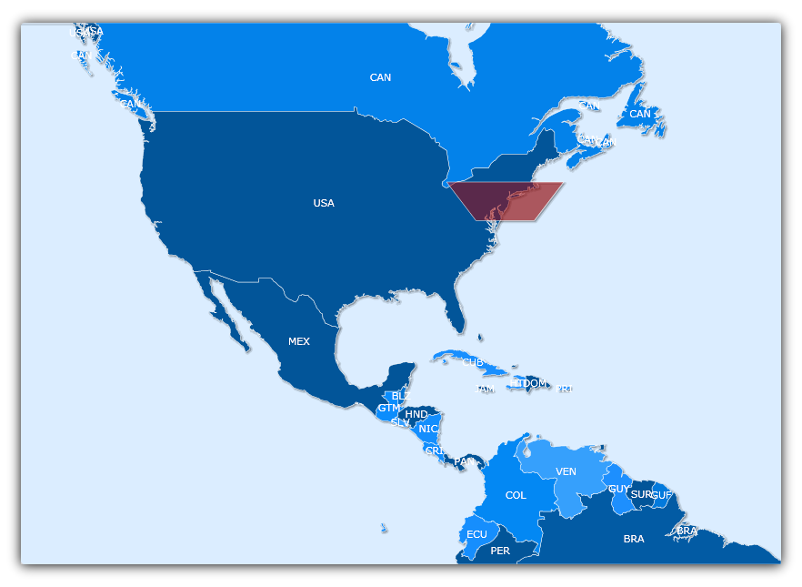

////

|metadata|
{
    "name": "xamwebmap-add-surface-element",
    "controlName": ["xamMap"],
    "tags": ["Application Scenarios","Data Presentation","How Do I"],
    "guid": "{F4C4FA06-B489-4361-81EC-132C099318DD}",  
    "buildFlags": [],
    "createdOn": "2016-05-25T18:21:57.1822677Z"
}
|metadata|
////

= Add Surface Element

A link:{ApiPlatform}controls.maps.xammap.v{ProductVersion}~infragistics.controls.maps.surfaceelement.html[SurfaceElement] object represents polygons and shapes in xamMap™. You can add your own SurfaceElement objects to display custom shapes. You must define at least 3 points, specified in either Geodetic or Cartesian coordinates, to create a custom shape.

The following code shows you how to create a boat that is docked on the east coast of the United States, using the link:{ApiPlatform}controls.maps.xammap.v{ProductVersion}~infragistics.controls.maps.maplayer~imported_ev.html[Imported] event of the map layer.

*In Visual Basic:*

----
Private Sub worldLayer_Imported(ByVal sender As System.Object, ByVal e As Infragistics.Controls.Maps.MapLayerImportEventArgs)
   If e.Action = MapLayerImportAction.[End] Then
      ' Polyline collection to hold points for shape 
      Dim lines As New MapPolylineCollection()
      Dim points As New List(Of Point)()
      ' Points to make the shape 
      points.Add(New Point(-74.535 - 2, 40.246 - 1))
      points.Add(New Point(-74.535 + 2, 40.246 - 1))
      points.Add(New Point(-74.535 + 4, 40.246 + 1))
      points.Add(New Point(-74.535 - 4, 40.246 + 1))
      ' Convert Geodetic to Cartesian coordinates 
      lines.Add(map1.MapProjection.ProjectToMap(points))
      ' Create surface element and position shape using polylines 
      Dim surfaceElement As New SurfaceElement()
      surfaceElement.Polylines = lines
      surfaceElement.Fill = New SolidColorBrush(Colors.Brown)
      map1.Layers(0).Elements.Add(surfaceElement) 
      Dim worldRect As Rect = surfaceElement.WorldRect
      worldRect = lines.GetWorldRect()
      surfaceElement.WorldRect = worldRect
   End If
End Sub
----

*In C#:*

----
private void worldLayer_Imported(object sender, Infragistics.Controls.Maps.MapLayerImportEventArgs e)
{
   if (e.Action == MapLayerImportAction.End)
   {
      // Polyline collection to hold points for shape
      MapPolylineCollection lines = new MapPolylineCollection();
      List<Point> points = new List<Point>();
      // Points to make the shape
      points.Add(new Point(-74.535 - 2, 40.246 - 1));
      points.Add(new Point(-74.535 + 2, 40.246 - 1));
      points.Add(new Point(-74.535 + 4, 40.246 + 1));
      points.Add(new Point(-74.535 - 4, 40.246 + 1));
      // Convert Geodetic to Cartesian coordinates
      lines.Add(map1.MapProjection.ProjectToMap(points));
      // Create surface element and position shape using polylines
      SurfaceElement surfaceElement = new SurfaceElement() { Polylines = lines, Fill = new SolidColorBrush(Colors.Brown) };
      map1.Layers[0].Elements.Add(surfaceElement);
      Rect worldRect = surfaceElement.WorldRect;
      worldRect = lines.GetWorldRect();
      surfaceElement.WorldRect = worldRect;
   }
}
----

== Related Topics

link:xamwebmap-add-image-using-map-elements.html[Add Image Using Map Elements]

link:xamwebmap-add-symbol-element.html[Add Symbol Element]

link:xamwebmap-add-path-element.html[Add Path Element]

link:xamwebmap-map-elements-color-map-elements.html[Color Map Elements]

link:xamwebmap-set-custom-format-string.html[Set Custom Format String]