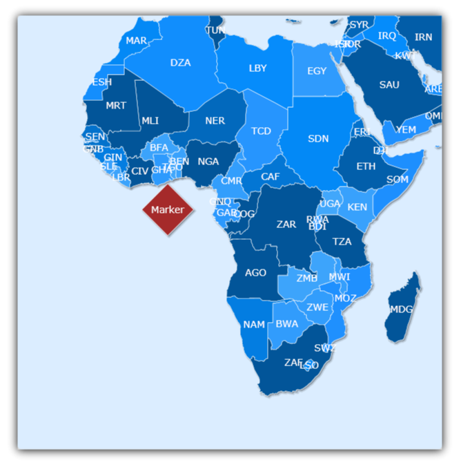

////

|metadata|
{
    "name": "xamwebmap-add-symbol-element",
    "controlName": ["xamMap"],
    "tags": ["Application Scenarios","Data Presentation","How Do I"],
    "guid": "{DCA1A944-C5B0-49A0-A438-8B5C2694F098}",  
    "buildFlags": [],
    "createdOn": "2016-05-25T18:21:57.1882676Z"
}
|metadata|
////

= Add Symbol Element

If you need to add a marker for points of interests in xamMap™, you can use the link:{ApiPlatform}controls.maps.xammap.v{ProductVersion}~infragistics.controls.maps.symbolelement.html[SymbolElement] object. This derived link:{ApiPlatform}controls.maps.xammap.v{ProductVersion}~infragistics.controls.maps.mapelement.html[MapElement] type allows you to add predefined shapes to the control. You can use Cartesian or Geodetic coordinates to define the placement of the symbol.

The following code shows you how to add a diamond-shaped Symbol Element at the Equator using Geodetic coordinates.

ifdef::wpf[]

*In XAML:*

----
<igMap:XamMap x:Name="xamMap">
   <igMap:XamMap.Layers>
      <igMap:MapLayer x:Name="worldLayer" Imported="worldLayer_Imported">
         <igMap:MapLayer.Reader>
            <igMap:ShapeFileReader Uri="/../../Shapefiles/world" DataMapping="Name=CNTRY_NAME; Caption=CNTRY_NAME" />
         </igMap:MapLayer.Reader>
      </igMap:MapLayer>
   </igMap:XamMap.Layers>
</igMap:XamMap>
----

endif::wpf[]

*In Visual Basic:*

----
Private Sub worldLayer_Imported(ByVal sender As System.Object, ByVal e As Infragistics.Controls.Maps.MapLayerImportEventArgs)
        If e.Action = MapLayerImportAction.End Then
            ' Coordinates for point at equator 
            Dim latitude As Double = 0
            Dim longitude As Double = 0
            ' Get Point data using a projection from Geodetic to Cartesian coordinates 
            Dim origin As Point = xamMap.MapProjection.ProjectToMap(New Point(longitude, latitude))
            Dim element As New SymbolElement()
            element.SymbolOrigin = origin
            element.Caption = "Marker"
            element.SymbolType = MapSymbolType.Diamond
            element.SymbolSize = 10
            xamMap.Layers(0).Elements.Add(element)
        End If
End Sub
----

*In C#:*

----
private void worldLayer_Imported(object sender, MapLayerImportEventArgs e)
{
   if (e.Action == MapLayerImportAction.End)
   {
       // Coordinates for point at equator 
       double latitude = 0;
       double longitude = 0;
       // Get Point data using a projection from Geodetic to Cartesian coordinates
       Point origin = xamMap.MapProjection.ProjectToMap(new Point(longitude, latitude));
       SymbolElement element = new SymbolElement() 
       { SymbolOrigin = origin, Caption = "Marker", SymbolType = MapSymbolType.Diamond, SymbolSize = 10 };
       xamMap.Layers[0].Elements.Add(element);
    }
 }
----

== Related Topics

link:xamwebmap-add-image-using-map-elements.html[Add Image Using Map Elements]

link:xamwebmap-add-path-element.html[Add Path Element]

link:xamwebmap-add-surface-element.html[Add Surface Element]

link:xamwebmap-map-elements-color-map-elements.html[Color Map Elements]

link:xamwebmap-set-custom-format-string.html[Set Custom Format String]