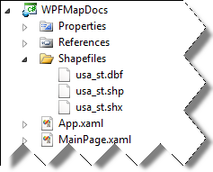

////
|metadata|
{
    "name": "xamwebmap-display-map-accessdata-using-shapefiles",
    "controlName": ["xamMap"],
    "tags": ["Data Presentation","How Do I"],
    "guid": "1fa759f3-d5ce-47c0-afd9-9715096d82f7",
    "buildFlags": [],
    "createdOn": "2016-05-25T18:21:57.3172392Z"
}
|metadata|
////

= Binding Shapefiles

== Before You Begin

The xamMap™ control displays information derived from Shapefiles. For example, if a Shapefile contains information for a map of the United States, xamMap displays this map. For more information on the Shapefile format and its composition, see link:xamwebmap-understanding-xamwebmap.html[Understanding xamMap].

== What You will Accomplish

You will set up the xamMap control to display a map of the United States.

== Follow these Steps

[start=1]
. Create a Microsoft® {PlatformName}® project.
[start=2]
. In the Solution Explorer, add the following reference to your project:

** {ApiPlatform}Controls.Maps.XamMap{ApiVersion}.dll
** {ApiPlatform}DataVisualization{ApiVersion}.dll
** {ApiPlatform}{ApiVersion}dll

[start=3]
. Add the following namespaces declaration for the xamMap control.

*In XAML:*

----
xmlns:igMap="http://schemas.infragistics.com/xaml"
----

*In Visual Basic:*

----
Imports Infragistics.Controls.Maps
Imports Infragistics
----

*In C#:*

----
using Infragistics.Controls.Maps;
using Infragistics;
----

[start=4]

. Add the Shapefiles you intend to use to your project in a subfolder called "Shapefiles". The xamMap control's ShapeFileReader can open a Shapefiles regardless of its location on the Hard Drive - this is achieved using an absolute path (for example "C:\Data\YourShapefileName"). The Shapefiles can also be included in your project:

In this case you can specify the file via a relative path - from the image it would be "/../../ShapeFiles/usa_st", because the executable file will be located in the "ProjectPath\bin\Debug\" folder.
[start=5]
. Add the xamMap control to your project.

*In XAML:*

----
<igMap:XamMap x:Name="xamMap">
   <!-- TODO: Add Map Layer -->            
</igMap:XamMap>
----

*In Visual Basic:*

----
Dim xamMap As New xamMap()
Me.LayoutRoot.Children.Add(xamMap)
----

*In C#:*

----
XamMap xamMap = new xamMap();
this.LayoutRoot.Children.Add(xamMap);
----

[start=6]
. Create a link:{ApiPlatform}controls.maps.xammap{ApiVersion}~infragistics.controls.maps.maplayer.html[MapLayer] object to display the information from the Shapefiles.

*In XAML:*

----
<igMap:XamMap.Layers>
   <igMap:MapLayer x:Name="statesLayer">
      <!-- TODO: Read in Shapefile -->
   </igMap:MapLayer>
</igMap:XamMap.Layers>
----

*In Visual Basic:*

----
Dim statesLayer As New MapLayer()
xamMap.Layers.Add(statesLayer)
----

*In C#:*

----
MapLayer statesLayer = new MapLayer();
xamMap.Layers.Add(statesLayer);
----

[start=7]
. Create a link:{ApiPlatform}controls.maps.xammap{ApiVersion}~infragistics.controls.maps.shapefilereader.html[ShapeFileReader] object to read information from the Shapefiles and perform the desired data mappings.

*In XAML:*

[source]
----
<igMap:MapLayer.Reader>
   <igMap:ShapeFileReader Uri="/../../Shapefiles/usa_st"
----

[source]
----
DataMapping="Caption=STATE_ABBR" />
</igMap:MapLayer.Reader>
----

*In Visual Basic:*

----
Dim reader As New ShapeFileReader()
reader.Uri = "Shapefiles/usa_st/../../ShapeFiles/usa_st"
Dim converter As New DataMapping.Converter()
reader.DataMapping = TryCast(converter.ConvertFromString("Caption=STATE_ABBR"), DataMapping)
statesLayer.Reader = reader
----

*In C#:*

[source]
----
ShapeFileReader reader = new ShapeFileReader();
reader.Uri = "Shapefiles/usa_st/../../ShapeFiles/usa_st";
DataMapping.Converter converter = new DataMapping.Converter();
reader.DataMapping = converter.ConvertFromString("Caption=STATE_ABBR") as
DataMapping;
statesLayer.Reader = reader;
----

[start=8]
. Run the application. The xamMap control displays a map of the United States using the Shapefiles data.

image::images/SL_DV_XamMap_Displaying_XamMap_Using_Shapefiles_02.png[]