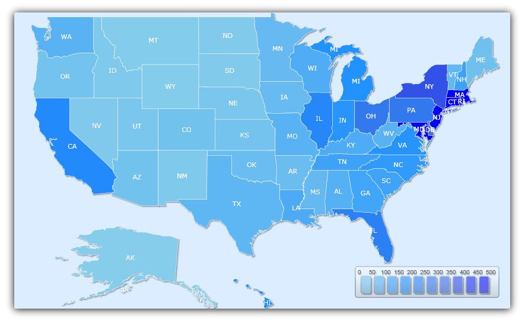
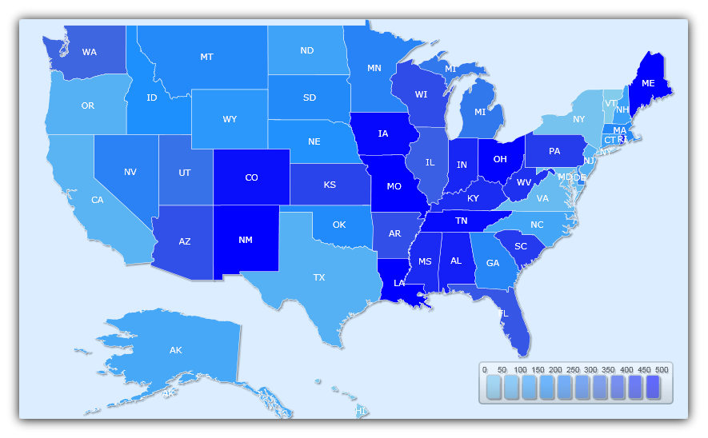
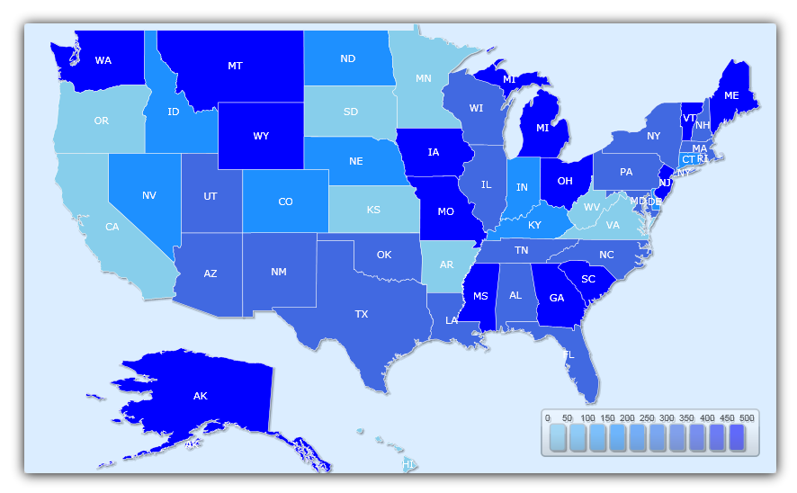

////

|metadata|
{
    "name": "xamwebmap-fill-modes",
    "controlName": ["xamMap"],
    "tags": ["How Do I","Styling"],
    "guid": "{E33267CF-5F28-4A98-9E41-03D592C237BD}",  
    "buildFlags": [],
    "createdOn": "2016-05-25T18:21:57.2352742Z"
}
|metadata|
////

= Using Fill Modes

The xamMap™ control has three fill modes to color the different elements of the control: link:{ApiPlatform}controls.maps.xammap.v{ProductVersion}~infragistics.controls.maps.mapfillmode.html[RandomInterpolate], link:{ApiPlatform}controls.maps.xammap.v{ProductVersion}~infragistics.controls.maps.mapfillmode.html[RandomSelect], and link:{ApiPlatform}controls.maps.xammap.v{ProductVersion}~infragistics.controls.maps.mapfillmode.html[Choropleth]. When you set the link:{ApiPlatform}controls.maps.xammap.v{ProductVersion}~infragistics.controls.maps.maplayer~fillmode.html[FillMode] property of a layer to one of these options, the link:{ApiPlatform}controls.maps.xammap.v{ProductVersion}~infragistics.controls.maps.xammap.html[XamMap] control uses the layer's selection of brushes to fill in the colors of the elements. If using solid color brushes, you can define the colors using the Brushes attribute of xamMap to shorten your XAML.

*Choropleth Mode*

link:{ApiPlatform}controls.maps.xammap.v{ProductVersion}~infragistics.controls.maps.mapfillmode.html[Choropleth] mode allows for more flexibility than the previous two modes. The mode depends on a value scale and fills in the color of an element, depending on the element's value. The following image show how population per square mile for USA can be visualized using in Choropleth fill mode on the xamMap control.

*In XAML:*

----
<igMap:MapLayer x:Name="statesLayer" FillMode="Choropleth" Brushes="Blue Yellow Red">
</igMap:MapLayer>
----

*Random Interpolate Mode*

The link:{ApiPlatform}controls.maps.xammap.v{ProductVersion}~infragistics.controls.maps.mapfillmode.html[RandomInterpolate] fill mode randomly fill the xamMap control's elements with the range of colors from the brushes. With RandomInterpolate fill mode and selection of solid color brushes of "SkyBlue", "DodgerBlue", "RoyalBlue" and "Blue", a map that shows population per square mile for USA, will be visualized as the following image.

*In XAML:*

----
<igMap:MapLayer x:Name="statesLayer" FillMode="RandomInterpolate" Brushes="Blue Yellow Red">
</igMap:MapLayer>
----

*Random Select Mode*

In link:{ApiPlatform}controls.maps.xammap.v{ProductVersion}~infragistics.controls.maps.mapfillmode.html[RandomSelect] mode, the layer's brushes are used to randomly fill in the xamMap control's elements. With RandomSelect fill mode and the same selection of brushes as above, a map that shows population per square mile for USA, may look like the map below.

*In XAML:*

----
<igMap:MapLayer x:Name="statesLayer" FillMode="RandomSelect" Brushes="Blue Yellow Red">
</igMap:MapLayer>
----

== Color Map Elements Using Choropleth Mode

== Before You Begin

The link:{ApiPlatform}controls.maps.xammap.v{ProductVersion}~infragistics.controls.maps.mapfillmode.html[Choropleth] fill mode allows you to color the elements of xamMap™ based on their values. To do this you need to define a link:{ApiPlatform}controls.maps.xammap.v{ProductVersion}~infragistics.controls.maps.valuescale.html[ValueScale] object with a minimum and maximum value. The range of colors available to each element depends on the color of the brushes and the range of values. In other words, the Value Scale uses the Layer’s Brushes collection to find an appropriate scaled brush based on the numeric value of each element, in relation to the Value Scale’s minimum and maximum values.

There are 3 types of Value Scales: link:{ApiPlatform}controls.maps.xammap.v{ProductVersion}~infragistics.controls.maps.linearscale.html[LinearScale], link:{ApiPlatform}controls.maps.xammap.v{ProductVersion}~infragistics.controls.maps.logarithmicscale.html[LogarithmicScale], and link:{ApiPlatform}controls.maps.xammap.v{ProductVersion}~infragistics.controls.maps.distributionscale.html[DistributionScale]. The use of each one depends on your application.

== What You will Accomplish

You will learn how to use a link:{ApiPlatform}controls.maps.xammap.v{ProductVersion}~infragistics.controls.maps.logarithmicscale.html[LogarithmicScale] in Choropleth mode to color the elements of the link:{ApiPlatform}controls.maps.xammap.v{ProductVersion}~infragistics.controls.maps.xammap.html[XamMap] control based on their values for population per square miles using a selection of blue, green, yellow, and red brushes. The following image show how population per square mile for USA can be visualized using Logarithmic Scale in Choropleth fill mode on the xamMap control.

== Follow these Steps

[start=1]
. Add a xamMap control named xamMap to the page. For information on how to set up your Microsoft® {PlatformName}™ application to display xamMap, see link:xamwebmap-display-map-using-shapefiles.html[Binding Shapefiles].

.Note:
[NOTE]
====
It is important you set the value property or Choropleth mode will not function properly.
====

[start=2]
. Add the following namespace declarations for xamMap.

*In XAML:*

----
xmlns:igMap="http://schemas.infragistics.com/xaml"
----

*In Visual Basic:*

----
Imports Infragistics.Controls.Maps
----

*In C#:*

----
using Infragistics.Controls.Maps;
----

[start=3]
. Add a map layer that uses link:{ApiPlatform}controls.maps.xammap.v{ProductVersion}~infragistics.controls.maps.mapfillmode.html[Choropleth Fill Mode] in the link:{ApiPlatform}controls.maps.xammap.v{ProductVersion}~infragistics.controls.maps.maplayer.html[MapLayer] collection for xamMap.

*In XAML:*

----
<igMap:MapLayer x:Name="statesLayer" FillMode="Choropleth">
       <!-- TODO: Read in Shapefile, define brushes, and define value scale. -->
</igMap:MapLayer>
----

*In Visual Basic:*

----
Dim statesLayer As New MapLayer()
xamMap.Layers.Add(statesLayer)
statesLayer.FillMode = MapFillMode.Choropleth
----

*In C#:*

----
// Create map layer and set Choropleth mode
MapLayer statesLayer = new MapLayer();
xamMap.Layers.Add(statesLayer);
statesLayer.FillMode = MapFillMode.Choropleth;
----

[start=4]
. Set the link:{ApiPlatform}controls.maps.xammap.v{ProductVersion}~infragistics.controls.maps.reader~datamapping.html[DataMapping] object's Caption and Value properties to the following attributes. This will map caption to state abbreviation column and values to the population density column.

ifdef::wpf[]

*In XAML:*

----
<igMap:MapLayer.Reader>
   <igMap:ShapeFileReader Uri="/../../Shapefiles/usa_st" DataMapping="Caption=STATE_ABBR; Value=POP90_SQMI" />
</igMap:MapLayer.Reader>
----

endif::wpf[]

ifdef::wpf[]

*In Visual Basic:*

----
Dim reader As New ShapeFileReader()
reader.Uri = "/../../Shapefiles/usa_st"
Dim converter As New DataMapping.Converter()
reader.DataMapping = TryCast(converter.ConvertFromString("Caption=STATE_ABBR; Value=POP90_SQMI"), DataMapping)
statesLayer.Reader = reader
----

endif::wpf[]

ifdef::wpf[]

*In C#:*

----
ShapeFileReader reader = new ShapeFileReader();
reader.Uri = "/../../Shapefiles/usa_st";
DataMapping.Converter converter = new DataMapping.Converter();
reader.DataMapping = converter.ConvertFromString("Caption=STATE_ABBR; Value=POP90_SQMI") as DataMapping;
statesLayer.Reader = reader;
----

endif::wpf[]

[start=5]
. Add link:{ApiPlatform}datavisualization.v{ProductVersion}~infragistics.brushcollection.html[BrushCollection] object to the link:{ApiPlatform}controls.maps.xammap.v{ProductVersion}~infragistics.controls.maps.maplayer~brushes.html[Brushes] property of XamMap control's MapLayer.

*In XAML:*

----
<igMap:MapLayer.Brushes>
   <ig:BrushCollection>
      <SolidColorBrush Color="SkyBlue" />
      <SolidColorBrush Color="DodgerBlue" />
      <SolidColorBrush Color="RoyalBlue" />
      <SolidColorBrush Color="Blue" />
   </ig:BrushCollection>
</igMap:MapLayer.Brushes>
----

*In Visual Basic:*

----
' Declare brush collection
Dim brushCollection As New Infragistics.BrushCollection()
brushCollection.Add(New SolidColorBrush(Colors.SkyBlue))
brushCollection.Add(New SolidColorBrush(Colors.DodgerBlue))
brushCollection.Add(New SolidColorBrush(Colors.RoyalBlue))
brushCollection.Add(New SolidColorBrush(Colors.Blue))
' Set brush collection to use 
statesLayer.Brushes = brushCollection
----

*In C#:*

----
// Declare brush collection 
BrushCollection brushCollection = new Infragistics.BrushCollection();
brushCollection.Add(new SolidColorBrush(Colors.SkyBlue));
brushCollection.Add(new SolidColorBrush(Colors.DodgerBlue));
brushCollection.Add(new SolidColorBrush(Colors.RoyalBlue));
brushCollection.Add(new SolidColorBrush(Colors.Blue));
// Set brush collection to use
statesLayer.Brushes = brushCollection;
----

[start=6]
. Declare a link:{ApiPlatform}controls.maps.xammap.v{ProductVersion}~infragistics.controls.maps.maplayer~valuescale.html[ValueScale] to use with Choropleth mode. Since the population values range from 0 to 9200, with most of the distribution in the smaller range, we can use a logarithmic scale from 0 to 500\.

*In XAML:*

----
<igMap:MapLayer.ValueScale>
   <igMap:LogarithmicScale IsAutoRange="  MinimumValue="0" MaximumValue="500" />
</igMap:MapLayer.ValueScale>
----

*In Visual Basic:*

----
' Declare value scale 
statesLayer.ValueScale = New LogarithmicScale()
statesLayer.ValueScale.IsAutoRange = False
statesLayer.ValueScale.MinimumValue = 0
statesLayer.ValueScale.MaximumValue = 500
----

*In C#:*

----
// Declare value scale
statesLayer.ValueScale = new LogarithmicScale();
statesLayer.ValueScale.IsAutoRange = false;
statesLayer.ValueScale.MinimumValue = 0;
statesLayer.ValueScale.MaximumValue = 500;
----

[start=7]
. Run the application. The xamMap control displays a map of the U.S colored by population density; The denser a state, the more blue it is.

