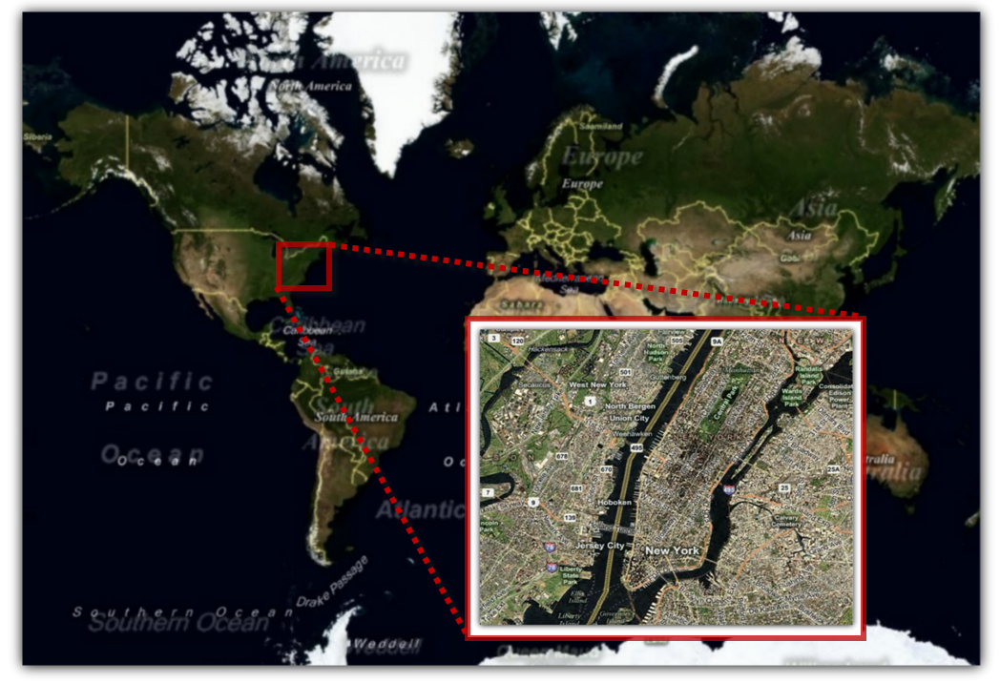

////

|metadata|
{
    "name": "xamwebmap-geo-imagery-integration",
    "controlName": ["xamMap"],
    "tags": [],
    "guid": "{8D5A9002-7601-4526-82EE-0C97E0707E3B}",  
    "buildFlags": [],
    "createdOn": "2016-05-25T18:21:57.1512295Z"
}
|metadata|
////

= Geo-Imagery Integration

The xamMap™ control’s link:{ApiPlatform}controls.maps.xammap{ApiVersion}~infragistics.controls.maps.xammap~maptilesource.html[MapTileSource] property of is used to configure the source from which geo-imagery is loaded. Please refer to the link:xamwebmap-supported-geo-imagery.html[Supported Geo-Imagery] section for a complete list of supported geo-imagery sources. It is important to know that the link:{ApiPlatform}controls.maps.xammap{ApiVersion}~infragistics.controls.maps.xammap.html[xamMap] control’s link:{ApiPlatform}controls.maps.xammap{ApiVersion}~infragistics.controls.maps.xammap~mapprojectiontype.html[MapProjectionType] property might have to be set in order to match the projection type used by the image tile provider, otherwise, the Shapefile being used may not align correctly with the images. In the event that your shape files do not align with the image tiles, you should try to change the xamMap control’s MapProjectionType property to any one of the available enumerated values to see if that resolves the issue. For complete list of currently supported Map Projection Types, refer to section about Map Projections in the link:xamwebmap-understanding-xamwebmap.html[Understanding xamMap] article.

Geo-Imagery provides a very detailed representation of the world from a top view perspective. Geo-Imagery consists of displaying aerial map view or road map view. You can use Geo-Imagery along with the xamMap™ control to provide your end users with rich, interactive world maps.

The following image is an example of Geo-Imagery supported in xamMap:

Click the following links to view topics written specifically to help you access geo-imagery data using the xamMap control.

* link:xamwebmap-add-bing-maps-as-geo-imagery-data-source.html[Binding Bing Maps]
* link:xamwebmap-add-open-street-maps-as-geo-imagery-data-source.html[Binding Open Street Maps]
* link:xamwebmap-merge-bing-maps-with-shapefile.html[Merging Bing Maps with Shapefile]
* link:xamwebmap-merge-open-street-maps-with-shapefile.html[Merging Open Street Maps with Shapefile]
* link:xamwebmap-display-different-layer-types.html[Display Different Layer Types]
* link:xamwebmap-supported-geo-imagery.html[Supported Geo-Imagery]
* link:xamwebmap-navigate-geo-imagery-map.html[Navigate Geo-Imagery Map]