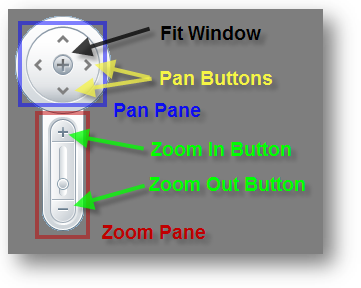
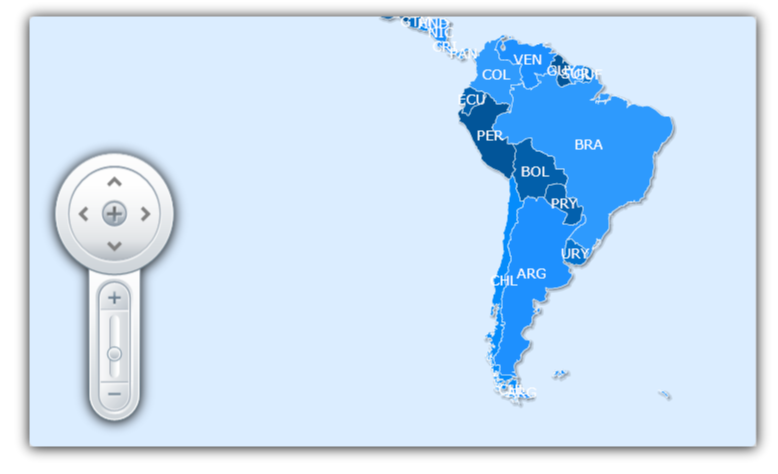
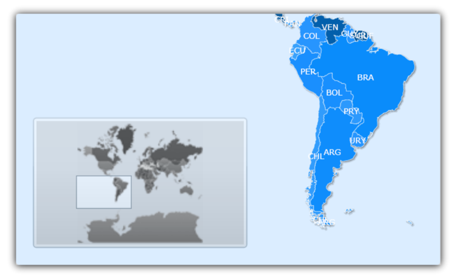
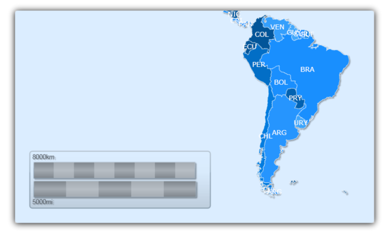

////

|metadata|
{
    "name": "xamwebmap-map-panes",
    "controlName": ["xamMap"],
    "tags": [],
    "guid": "{05F54E15-055D-4340-B162-4277A6BEB0F8}",  
    "buildFlags": [],
    "createdOn": "2016-05-25T18:21:57.2532752Z"
}
|metadata|
////

= Display Map Panes

This section is your gateway to important conceptual and task-based information that will help you understand Map Panes.

== Display Navigation Pane

The link:{ApiPlatform}controls.maps.xammap.v{ProductVersion}~infragistics.controls.maps.mapnavigationpane.html[MapNavigationPane] object of xamMap™ is used for navigation within the view port area of the control. It consists of a pan pane and a zoom pane. The pan pane contains buttons for moving around areas of the map, while the zoom pane contains a slider bar for zooming in and out.

.Note:
[NOTE]
====
When using any panes in xamMap you may want to dock them to a side of the control. The xamMap control uses a xamDock™ panel by default to lay out controls. If you need to set xamDock's attached properties, make sure you include the Infragistics.Controls. namespace.
====

To display the Navigation Pane inside and to the right edge of the dock panel, use the following code:

*In XAML:*

----
xmlns:ig="http://schemas.infragistics.com/xaml"
<!-- ... -->
<ig:XamMap x:Name="xamMap" >
        <ig:MapNavigationPane ig:XamDock.Edge="InsideRight" Margin="10"/>
</ig:XamMap>
----

*In Visual Basic:*

----
' Add Navigation Pane control 
Dim navPane As New MapNavigationPane()
navPane.SetValue(XamDock.EdgeProperty, DockEdge.InsideRight)
navPane.Margin = New Thickness(10)
xamMap.LogicalChildren.Add(navPane)
----

*In C#:*

----
// Add Navigation Pane control 
MapNavigationPane navPane = new MapNavigationPane();
navPane.SetValue(XamDock.EdgeProperty, DockEdge.InsideRight);
navPane.Margin = new Thickness(10);
xamMap.LogicalChildren.Add(navPane);
----

== Display Thumbnail Pane

The link:{ApiPlatform}controls.maps.xammap.v{ProductVersion}~infragistics.controls.maps.mapthumbnailpane.html[MapThumbnailPane] pane helps end users navigate large maps through the xamMap™ viewport. The Thumbnail Pane can be used to display a thumbnail of the entire map along with a small rectangle that represents which portion of the map is currently visible. End users can click and move this rectangle across the Thumbnail Pane to effectively display a Map section within the viewport.

There is no image created by default for the Thumbnail Pane. You can provide your own by creating a style with a thumbnail image and assign that style to the link:{ApiPlatform}controls.maps.xammap.v{ProductVersion}~infragistics.controls.maps.mapthumbnailpane~worldstyle.html[WorldStyle] property.

The following code shows how to display a Thumbnail Pane with a thumbnail image in xamMap.

.Note:
[NOTE]
====
When using any panes in xamMap you may want to dock them to a side of the control. The xamMap control uses a xamDock™ panel by default to lay out controls. If you need to set xamDock's attached properties, make sure you include the Infragistics.Controls. namespace.
====

*In XAML:*

----
xmlns:ig="http://schemas.infragistics.com/xaml"
<!-- ... -->
<ig:MapThumbnailPane ig:XamDock.Edge="InsideBottom" Width="300" Height="150">
   <ig:MapThumbnailPane.WorldStyle>
      
   </ig:MapThumbnailPane.WorldStyle>        
</ig:MapThumbnailPane>
----

*In Visual Basic:*

----
Dim thumbnailPane As New MapThumbnailPane()
thumbnailPane.SetValue(XamDock.EdgeProperty, DockEdge.InsideBottom)
thumbnailPane.Width = 300
thumbnailPane.Height = 150
Dim imageSource As New BitmapImage()
imageSource.UriSource = New Uri("tinyWorld.png", UriKind.Relative)
Dim b As New ImageBrush()
b.ImageSource = imageSource
Dim worldStyle As New Style(GetType(Path))
worldStyle.Setters.Add(New Setter(Path.FillProperty, b))
thumbnailPane.WorldStyle = worldStyle
xamMap.LogicalChildren.Add(thumbnailPane)
----

*In C#:*

----
MapThumbnailPane thumbnailPane = new MapThumbnailPane();
thumbnailPane.SetValue(XamDock.EdgeProperty, DockEdge.InsideBottom);
thumbnailPane.Width = 300;
thumbnailPane.Height = 150;
BitmapImage imageSource = new BitmapImage();
imageSource.UriSource = new Uri("tinyWorld.png", UriKind.Relative);
ImageBrush b = new ImageBrush();
b.ImageSource = imageSource;
Style worldStyle = new Style(typeof(Path));
worldStyle.Setters.Add(new Setter(Path.FillProperty, b));
thumbnailPane.WorldStyle = worldStyle;
xamMap.LogicalChildren.Add(thumbnailPane);
----

== Display Scale Pane

The link:{ApiPlatform}controls.maps.xammap.v{ProductVersion}~infragistics.controls.maps.mapscalepane.html[MapScalePane] displays a sample distance on xamMap™ in relation to the control's current magnification. As your end-users zoom in and out, the Scale Pane updates the sample distance.

You can specify the unit of measure by setting the link:{ApiPlatform}controls.maps.xammap.v{ProductVersion}~infragistics.controls.maps.mapscalepane~ismetric.html[IsMetric] or link:{ApiPlatform}controls.maps.xammap.v{ProductVersion}~infragistics.controls.maps.mapscalepane~isimperial.html[IsImperial] properties.

.Note:
[NOTE]
====
When using any panes in xamMap you may want to dock them to a side of the control. The xamMap control uses a xamDock™ panel by default to lay out controls. If you need to set xamDock's attached properties, make sure you include the Infragistics.Controls. namespace.
====

To display the Scale Pane inside and to the top edge of the dock panel, use the following code:

*In XAML:*

----
xmlns:ig="http://schemas.infragistics.com/xaml"
<!-- ... -->
<ig:MapScalePane ig:XamDock.Edge="InsideTop" Width="200" />
----

*In Visual Basic:*

----
' Add Scale Pane control 
Dim scalePane As New MapScalePane()
scalePane.SetValue(XamDock.EdgeProperty, DockEdge.InsideTop)
scalePane.Width = 200
xamMap.LogicalChildren.Add(scalePane)
----

*In C#:*

----
// Add Scale Pane control 
MapScalePane scalePane = new MapScalePane();
scalePane.SetValue(XamDock.EdgeProperty, DockEdge.InsideTop);
scalePane.Width = 200;
xamMap.LogicalChildren.Add(scalePane);
----

