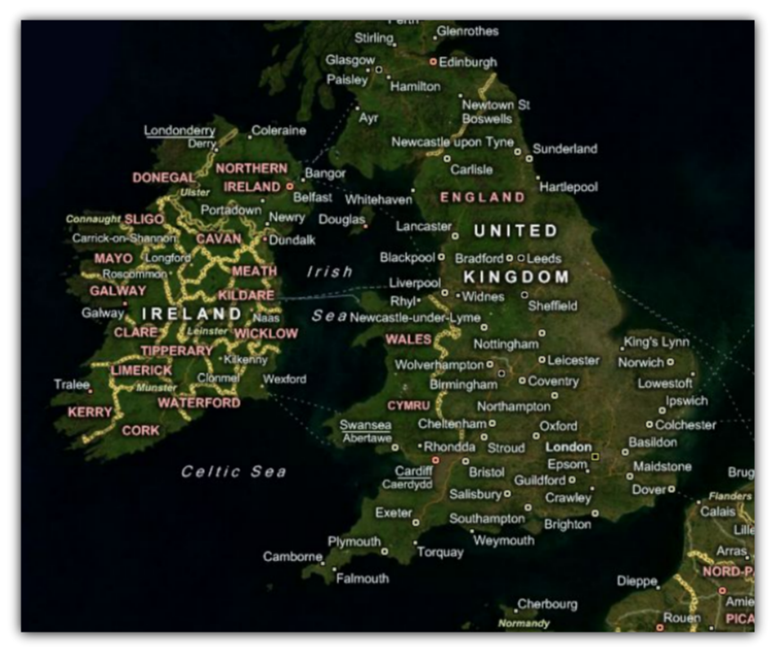
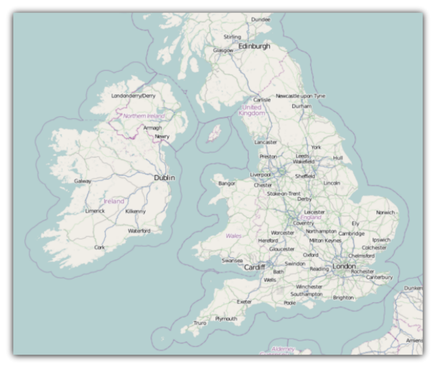

////

|metadata|
{
    "name": "xamwebmap-supported-geo-imagery",
    "controlName": ["xamMap"],
    "tags": ["Data Presentation","How Do I"],
    "guid": "{2DCCBB79-A8CC-498A-B56C-67CDFB968358}",  
    "buildFlags": [],
    "createdOn": "2016-05-25T18:21:57.1572303Z"
}
|metadata|
////

= Supported Geo-Imagery

The xamMap™ control provides support for rendering geographical imagery. The control’s link:{ApiPlatform}controls.maps.xammap.v{ProductVersion}~infragistics.controls.maps.xammap~maptilesource.html[MapTileSource] property is used to configure the source from which geo-imagery is loaded. Using the link:{ApiPlatform}controls.maps.xammap.v{ProductVersion}~infragistics.controls.maps.xammap.html[XamMap] control, you can also display different layer types of geo-imagery; for more information please see link:xamwebmap-display-different-layer-types.html[Display Different Layer Types]. Currently, geo-imagery is supported from the following external geo-imagery sources:

== Bing Maps

Bing Maps is a licensed web mapping service from Microsoft® and as result you will need to get your own credentials before you can start using it with the xamMap control. You can access this service directly on link:http://www.bing.com/maps[www.bing.com/maps] web site. For more information on integration of BingMaps geo-imagery with the xamMap control, please see link:xamwebmap-add-bing-maps-as-geo-imagery-data-source.html[Binding Bing Maps] section.

== Open Street Maps

Open Street Maps is a free web mapping service created collaboratively by people around the world. You can access this service directly on link:http://www.openstreetmap.org[www.openstreetmap.org] web site. For more information on integration of OpenStreetMap geo-imagery with the xamMap control, please see link:xamwebmap-add-open-street-maps-as-geo-imagery-data-source.html[Binding Open Street Maps] section.

== Related Topics:

* link:xamwebmap-add-bing-maps-as-geo-imagery-data-source.html[Binding Bing Maps]
* link:xamwebmap-add-open-street-maps-as-geo-imagery-data-source.html[Binding Open Street Maps]
* link:xamwebmap-display-different-layer-types.html[Display Different Layer Types]
* link:xamwebmap-geo-imagery-integration.html[Geo-Imagery Integration]