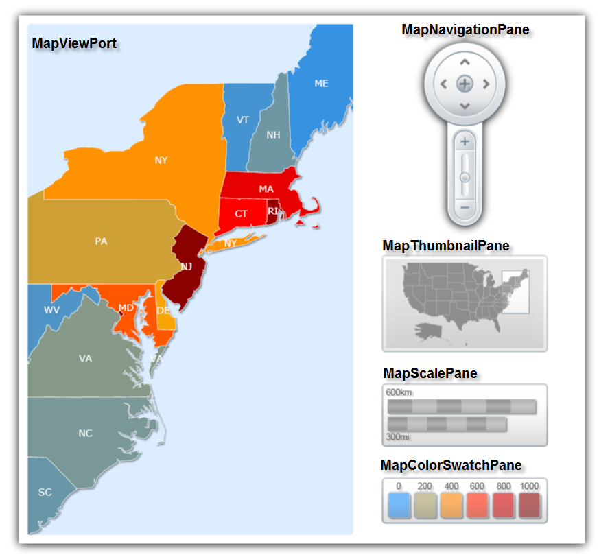
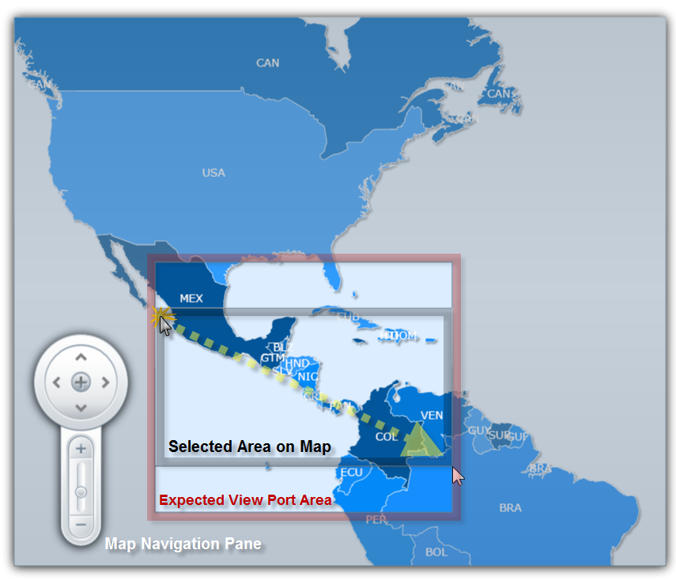

////

|metadata|
{
    "name": "xamwebmap-understanding-xamwebmap",
    "controlName": ["xamMap"],
    "tags": ["Application Scenarios","Data Presentation","How Do I"],
    "guid": "{457D9D23-1408-4D21-968E-3337563B98C1}",  
    "buildFlags": [],
    "createdOn": "2016-05-25T18:21:57.2652755Z"
}
|metadata|
////

= Understanding xamMap

This is a great place for you to get an introduction to the link:{ApiPlatform}controls.maps.xammap.v{ProductVersion}~infragistics.controls.maps.xammap.html[xamMap]™ control, and its key features and functionalities. The topics in this section will give you a better idea of why you would want to use xamMap in your applications.

== Data Mapping

Data mapping in xamMap allows you to bind link:{ApiPlatform}controls.maps.xammap.v{ProductVersion}~infragistics.controls.maps.mapelement.html[MapElement] properties to values in the data source. To do so, before reading in a Shapefile with a link:{ApiPlatform}controls.maps.xammap.v{ProductVersion}~infragistics.controls.maps.shapefilereader.html[ShapeFileReader], you must set the link:{ApiPlatform}controls.maps.xammap.v{ProductVersion}~infragistics.controls.maps.reader~datamapping.html[DataMapping] property of that reader.

The DataMapping property takes a semicolon delimited string of key-value pairs. The tokens are case-sensitive and determine the column and property to be mapped. The following is an example of a data mapping, given a Shapefile of the U.S states:

ifdef::wpf[]

*In XAML:*

----
<igMap:ShapeFileReader Uri="/../../Shapefiles/usa_st" DataMapping="Caption=STATE_ABBR" />
----

endif::wpf[]

This example binds the link:{ApiPlatform}controls.maps.xammap.v{ProductVersion}~infragistics.controls.maps.mapelement~caption.html[Caption] property of the map elements to the data of the STATE_ABBR column from the Shapefile. What displays is a map of the US states with each state showing a caption of its abbreviated state name.

You can also save the data of a column to an arbitrary property for an element:

ifdef::wpf[]

*In XAML:*

----
<igMap:ShapeFileReader Uri="/../../Shapefiles/usa_st" DataMapping="STATE_ABBREVIATIONS=STATE_ABBR"/>
----

endif::wpf[]

This XAML snippet will save the data of the STATE_ABBR column to a property named STATE_ABBREVIATIONS for each element. If you do not specify a data mapping, when xamMap reads in a Shapefile, all data columns are mapped to arbitrary properties in each element with the same name as the columns. You can access properties by passing in the property name to the link:{ApiPlatform}controls.maps.xammap.v{ProductVersion}~infragistics.controls.maps.mapelement~getproperty.html[GetProperty] method of an element. For example, passing in "STATE_ABBR" will get the state name abbreviation for an individual element, if no explicit data mapping is set. You can also set a property by using the link:{ApiPlatform}controls.maps.xammap.v{ProductVersion}~infragistics.controls.maps.mapelement~setproperty.html[SetProperty] method and passing in the property name and the value to set.

== Shapefiles

The xamMap control uses the popular link:http://en.wikipedia.org/wiki/Shapefile#Overview[Shapefile] format as the source for its map data. A Shapefile is a geospatial vector data format that describes points, polylines, and polygons. A Shapefile commonly refers to a collection of files, generally with extensions ".shp", ".shx", and ".dbf", using a common prefix name; eg, "states."

The xamMap control can display points, polylines, or polygons vector data, for things such as cities, roads, and states, depending on the Shapefile. The control uses one layer for every Shapefile.

== Map Layers

A link:{ApiPlatform}controls.maps.xammap.v{ProductVersion}~infragistics.controls.maps.maplayer.html[MapLayer] object is the means of displaying Shapefile data in xamMap. You can display multiple Shapefiles by using multiple layers.

You can use a link:{ApiPlatform}controls.maps.xammap.v{ProductVersion}~infragistics.controls.maps.shapefilereader.html[ShapeFileReader] object to read in the contents of a Shapefile and display the contents in a layer. The Shapefile must be placed in the ClientBin folder of the Web project. Further, you can perform a data mapping between the data of the Shapefile and properties of the map's elements to display more information.

For more information on reading a Shapefile and using data mapping, see link:xamwebmap-display-map-using-shapefiles.html[Binding Shapefiles].

== Map Elements

Map elements represent the graphical shapes, lines, and polygons on a given layer. They provide the means for interacting with shapes displayed by xamMap. Map elements take their properties from the layer they are on; these properties can also be set individually. For more information on map elements, see link:xamwebmap-map-elements.html[Display Map Elements].

== Map Layout

The xamMap control acts as a container for child controls, panes, and shape rectangles. These elements together help make up the visual representation of the map.

== Map Panes

The following is a list of the panes available in xamMap:

[start=1]
. link:{ApiPlatform}controls.maps.xammap.v{ProductVersion}~infragistics.controls.maps.mapscalepane.html[MapScalePane]
[start=2]
. link:{ApiPlatform}controls.maps.xammap.v{ProductVersion}~infragistics.controls.maps.mapcolorswatchpane.html[MapColorSwatchPane]
[start=3]
. link:{ApiPlatform}controls.maps.xammap.v{ProductVersion}~infragistics.controls.maps.mapnavigationpane.html[MapNavigationPane]
[start=4]
. link:{ApiPlatform}controls.maps.xammap.v{ProductVersion}~infragistics.controls.maps.mapthumbnailpane.html[MapThumbnailPane]

To lay out these different elements, xamMap contains a collection of layers and a xamDock™ panel to define the contents of the map body and specify the positioning of the controls, respectively.

If the children of the map are not placed in the Layers collection, they are routed to the LogicalChildren collection, and will be rendered as children of the xamDock control. As such, their dock position can be set using the xamDock.Edge attached property.

The map layers and all their elements are contained within the map viewport, which is docked centrally in the control area.

== Map View Port

The viewport is the visible region of the map, reserved for displaying geospatial data. The viewport has the following features:

* Built-in keyboard navigation for panning, zooming and fit
* Built-in mouse navigation for drag panning, area zoom with preview and area select

== Map Navigation

The xamMap control allows content panning and zooming . This can be done in a number of ways:

[start=1]
. Built-in keyboard navigation.

[options="header", cols="a,a"]
|====
|Operation|Description

|Panning
|Arrow keys

|Zooming
|Page Up and Page Down keys

|Fit
|Home key

|====

[start=2]
. Built-in mouse navigation.

[options="header", cols="a,a"]
|====
|Operation|Description

|Panning
|Mouse drag

|Zooming
|Mouse scroll

|Area zoom
|Shift + Mouse drag

|====

[start=3]
. Navigation Pane. Please refer to link:xamwebmap-navigate-geo-imagery-map.html[Navigate Geo-Imagery Map] for more information.

You can restrict panning and zooming using the link:{ApiPlatform}controls.maps.xammap.v{ProductVersion}~infragistics.controls.maps.xammap~ispannable.html[IsPannable] and link:{ApiPlatform}controls.maps.xammap.v{ProductVersion}~infragistics.controls.maps.xammap~iszoomable.html[IsZoomable] boolean properties.

== Zooming

Zooming works by increasing the xamMap control's window scale, which is represented by the link:{ApiPlatform}controls.maps.xammap.v{ProductVersion}~infragistics.controls.maps.xammap~windowscale.html[WindowScale] property. The factor of increase or decrease in the window scale is controlled by the link:{ApiPlatform}controls.maps.xammap.v{ProductVersion}~infragistics.controls.maps.xammap~windowzoombase.html[WindowZoomBase] property. By default, this property has a value of 1.3; by increasing the zoom level by 1, the window scale is multiplied by 1.3; by decreasing the zoom level by 1, the window scale is divided by 1.3.

To determine the zoom level based on the WindowScale value, use the xamMap control's link:{ApiPlatform}controls.maps.xammap.v{ProductVersion}~infragistics.controls.maps.xammap~scaletozoom.html[ScaleToZoom] method.

You can set a minimum and maximum zoom level in xamMap by setting the link:{ApiPlatform}controls.maps.xammap.v{ProductVersion}~infragistics.controls.maps.xammap~windowzoomminimum.html[WindowZoomMinimum] and link:{ApiPlatform}controls.maps.xammap.v{ProductVersion}~infragistics.controls.maps.xammap~windowzoommaximum.html[WindowZoomMaximum] properties.

== Map Projection

The xamMap control uses map projections to visualize map shapes. A map projection is a systematic process of converting a spherical surface to or from a planar representation; therefore, any map of geographic data requires the use of a map projection. The xamMap control uses map projections to transform geodetic coordinates to and from Cartesian coordinates.

Naturally, there is distortion when using map projections because it is impossible to accurately depict the surface of the Earth on a flat map. Certain projections are more accurate than others for certain characteristics of a map; it is up to the cartographer to decide which projection best fits their criteria.

.Note:
[NOTE]
====
The geo-imagery data is always pre-projected using Spherical Mercator map projection and this cannot be change. Therefore, when using geo-imagery as data source, you need to use Spherical Mercator map projection or your map data will not line up in the xamMap control.
====

The link:{ApiPlatform}controls.maps.xammap.v{ProductVersion}~infragistics.controls.maps.xammap.html[xamMap] control provides a wide selection of map projections. The ShapefileReader assumes no input projection; however, input projections can be configured using the link:{ApiPlatform}controls.maps.xammap.v{ProductVersion}~infragistics.controls.maps.shapefilereader.html[ShapeFileReader] object's link:{ApiPlatform}controls.maps.xammap.v{ProductVersion}~infragistics.controls.maps.reader~coordinatesystem.html[CoordinateSystem] property. For more information on changing coordinate system, please refer to link:xamwebmap-change-map-coordinate-system.html[Change Map Coordinate System] section.

[options="header", cols="a,a"]
|====
| link:{ApiPlatform}controls.maps.xammap.v{ProductVersion}~infragistics.controls.maps.xammap~mapprojectiontype.html[MapProjectionType]|Description

| link:{ApiPlatform}controls.maps.xammap.v{ProductVersion}~infragistics.controls.maps.mercator.html[Mercator]
|Mercator map projection.

| link:{ApiPlatform}controls.maps.xammap.v{ProductVersion}~infragistics.controls.maps.obliquemercator.html[ObliqueMercator]
|Oblique Mercator map projection.

| link:{ApiPlatform}controls.maps.xammap.v{ProductVersion}~infragistics.controls.maps.projectiontype.html[Lambert]
|Lambert Cylindrical Equal Area map projection.

| link:{ApiPlatform}controls.maps.xammap.v{ProductVersion}~infragistics.controls.maps.projectiontype.html[Behrmann]
|Behrmann Cylindrical Equal Area map projection.

| link:{ApiPlatform}controls.maps.xammap.v{ProductVersion}~infragistics.controls.maps.projectiontype.html[TristanEdwards]
|Tristan Edwards Cylindrical Equal Area map projection.

| link:{ApiPlatform}controls.maps.xammap.v{ProductVersion}~infragistics.controls.maps.projectiontype.html[Peters]
|Peters Cylindrical Equal Area map projection.

| link:{ApiPlatform}controls.maps.xammap.v{ProductVersion}~infragistics.controls.maps.projectiontype.html[GallOrthographic]
|Gall Orthographic Cylindrical Equal Area map projection.

| link:{ApiPlatform}controls.maps.xammap.v{ProductVersion}~infragistics.controls.maps.projectiontype.html[Balthasart]
|Balthasart Cylindrical Equal Area map projection.

| link:{ApiPlatform}controls.maps.xammap.v{ProductVersion}~infragistics.controls.maps.millercylindrical.html[MillerCylindrical]
|Miller Cylindrical map projection.

| link:{ApiPlatform}controls.maps.xammap.v{ProductVersion}~infragistics.controls.maps.projectiontype.html[Equirectangular]
|Equirectangular map projection.

| link:{ApiPlatform}controls.maps.xammap.v{ProductVersion}~infragistics.controls.maps.projectiontype.html[Miller37]
|Cylindrical equidistant map projection with a standard parallel of 37.5 degrees.

| link:{ApiPlatform}controls.maps.xammap.v{ProductVersion}~infragistics.controls.maps.projectiontype.html[Miller43]
|Cylindrical equidistant map projection with a standard parallel of 45.0 degrees.

| link:{ApiPlatform}controls.maps.xammap.v{ProductVersion}~infragistics.controls.maps.projectiontype.html[Miller50]
|Cylindrical equidistant map projection with a standard parallel of 50.0 degrees.

|====

For more detail information on map projections, please refer to the following online resources:

* link:http://www.nationalatlas.gov/articles/mapping/a_projections.html[http://www.nationalatlas.gov]
* link:http://www.progonos.com/furuti/MapProj/Normal/ProjTbl/projTbl.html[http://www.progonos.com]
* link:http://mathworld.wolfram.com/topics/MapProjections.html[http://mathworld.wolfram.com]
* link:http://en.wikipedia.org/wiki/Map_projection[http://en.wikipedia.org]
* link:http://egsc.usgs.gov/isb/pubs/MapProjections/projections.html#mercator[http://egsc.usgs.gov]
* link:http://www.csiss.org/map-projections/index.html[http://www.csiss.org]