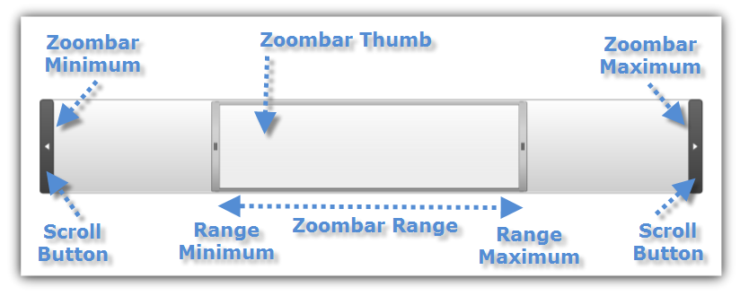
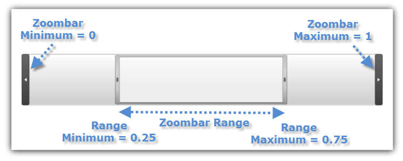
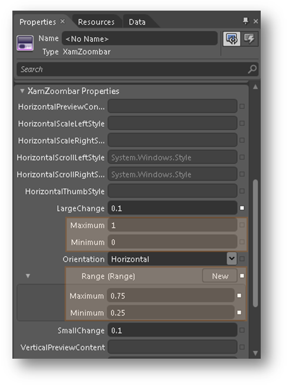

////

|metadata|
{
    "name": "xamzoombar-getting-started-with-xamzoombar",
    "controlName": ["xamZoombar"],
    "tags": ["Getting Started","Navigation"],
    "guid": "91f8b32c-ab76-4658-aa4f-30654d79c3b6",  
    "buildFlags": [],
    "createdOn": "2016-05-25T18:22:00.2114019Z"
}
|metadata|
////

= Getting Started with xamZoombar

== Before You Begin

The link:{ApiPlatform}datavisualization{ApiVersion}~infragistics.controls.xamzoombar.html[xamZoombar]™ control consists of a thumb, two buttons, and a preview area. The thumb controls the visible area as well as the zoom range. You can change the size of the thumb to increase or decrease the zoom scale. To change the zoom range, slide the thumb back and forth.

The following table explains in detail the most important properties of the xamZoombar control:

[options="header", cols="a,a,a"]
|====
|Property Name|Property Type|Description

| link:{ApiPlatform}datavisualization{ApiVersion}~infragistics.controls.xamzoombar~minimum.html[Minimum]
|double
|Determines the minimum possible value of the Range element in the xamZoombar control.

| link:{ApiPlatform}datavisualization{ApiVersion}~infragistics.controls.xamzoombar~maximum.html[Maximum]
|double
|Determines the maximum possible value of the Range element in the xamZoombar control.

| link:{ApiPlatform}datavisualization{ApiVersion}~infragistics.controls.xamzoombar~range.html[Range]
| link:{ApiPlatform}datavisualization{ApiVersion}~infragistics.controls.range.html[Range]
|Determines the current range (thumb location and size) in the xamZoombar control.

|====

== What You Will Accomplish

This section will show you how to setup your project for the xamZoombar control in Microsoft® Visual Studio® and Expression Blend®.

== Display xamZoombar in Visual Studio

[start=1]
. Create a Microsoft® {PlatformName}® project in Visual Studio.
[start=2]
. Add the following Infragistics assemblies as references in your project.

** {ApiPlatform}DataVisualization.{DllVersion}dll

[start=3]
. Add the following namespace declarations for xamZoombar control.

*In XAML:*

----
<xmlns:ig=http://schemas.infragistics.com/xaml/>
----

*In Visual Basic:*

----
Imports Infragistics.Controls
----

*In C#:*

----
using Infragistics.Controls;
----

[start=4]
. Add an instance of the xamZoombar control with the following attributes:

** Create a new xamZoombar object
** Set the link:{ApiPlatform}datavisualization{ApiVersion}~infragistics.controls.xamzoombar~minimum.html[Minimum] property to 0
** Set the link:{ApiPlatform}datavisualization{ApiVersion}~infragistics.controls.xamzoombar~maximum.html[Maximum] property to 1
** Create a new link:{ApiPlatform}datavisualization{ApiVersion}~infragistics.controls.range.html[Range] object
** Set the link:{ApiPlatform}datavisualization{ApiVersion}~infragistics.controls.range~minimum.html[Minimum] property on the range object to 0.25
** Set the link:{ApiPlatform}datavisualization{ApiVersion}~infragistics.controls.range~maximum.html[Maximum] property on the range object to 0.75

*In XAML:*

----
<ig:XamZoombar x:Name="zoombar" Minimum="0" Maximum="1">
        <ig:XamZoombar.Range>
                <ig:Range Minimum="0.25" Maximum="0.75" />
        </ig:XamZoombar.Range>
</ig:XamZoombar>
----

*In Visual Basic:*

----
Dim zoombar As New XamZoombar()
zoombar.Minimum = 0
zoombar.Maximum = 1
zoombar.Range = New Range() With { Key .Minimum = 0.25, Key .Maximum = 0.75 }
----

*In C#:*

----
XamZoombar zoombar = new XamZoombar();
zoombar.Minimum = 0;
zoombar.Maximum = 1;
zoombar.Range = new Range {Minimum = 0.25, Maximum = 0.75};
----

[start=5]
. Save and run the project. The xamZoombar control will load and display a thumbnail in the middle of the control as shown in the following image.

== Display xamZoombar in Expression Blend

[start=1]
. Create a Microsoft® {PlatformName}® project in Expression Blend.
[start=2]
. Add the following Infragistics assemblies as references in your project.

** {ApiPlatform}DataVisualization.{DllVersion}dll

[start=3]
. Select the xamZoombar control form the toolbox and drag it to the design surface.
[start=4]
. In the xamZoombar control properties tab, scroll down to the xamZoombar properties.

** Set the link:{ApiPlatform}datavisualization{ApiVersion}~infragistics.controls.xamzoombar~minimum.html[Minimum] property to 0
** Set the link:{ApiPlatform}datavisualization{ApiVersion}~infragistics.controls.xamzoombar~maximum.html[Maximum] property to 1
** Create a new link:{ApiPlatform}datavisualization{ApiVersion}~infragistics.controls.range.html[Range] object
** Set the link:{ApiPlatform}datavisualization{ApiVersion}~infragistics.controls.range~minimum.html[Minimum] property on the range object to 0.25
** Set the link:{ApiPlatform}datavisualization{ApiVersion}~infragistics.controls.range~maximum.html[Maximum] property on the range object to 0.75

[start=5]
. Save and run the project. The xamZoombar control will load and display a thumbnail in the middle of the control as shown in the following image.

== Related Topics:

* link:xamzoombar-using-xamzoombar.html[Series Requirements]