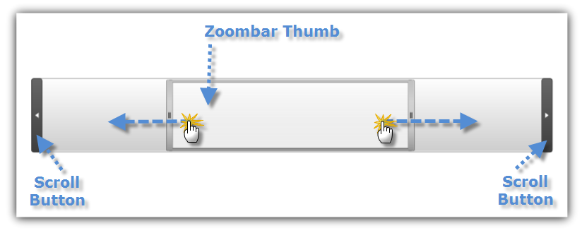
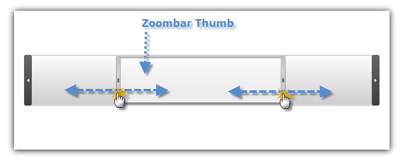
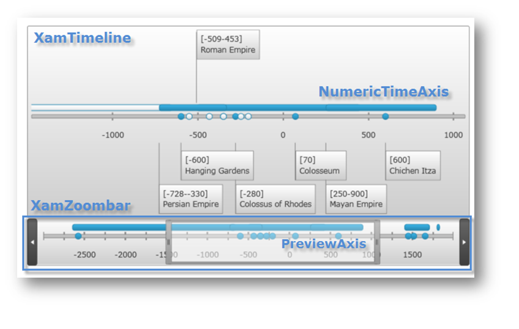
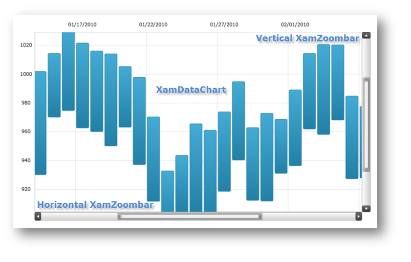

////

|metadata|
{
    "name": "xamzoombar-using-xamzoombar",
    "controlName": ["xamZoombar"],
    "tags": ["Getting Started"],
    "guid": "e3ecee0c-f139-491d-b4e4-9b8b7c161716",  
    "buildFlags": [],
    "createdOn": "2016-05-25T18:22:00.2224102Z"
}
|metadata|
////

= Using xamZoombar

This section is your gateway to important conceptual and task-based information, which will help you use the various features and functionalities provided by the link:{ApiPlatform}datavisualization.v{ProductVersion}~infragistics.controls.xamzoombar.html[xamZoombar]™ control.

== Navigation

This section shows how to navigate the xamZoombar control.

Scrolling when using the xamZoombar control is performed by either sliding the Thumb or by clicking on the Scroll Buttons. The following image shows you how to scroll in the xamZoombar control.

Zooming in the xamZoombar control is performed by changing the size of the Thumb. The following image shows you how to change the zoom range in the xamZoombar control.

== Integration

The xamZoombar control is fully integrated with the link:{ApiPlatform}controls.charts.xamdatachart.v{ProductVersion}~infragistics.controls.charts.xamdatachart.html[xamDataChart] and link:{ApiPlatform}controls.timelines.xamtimeline.v{ProductVersion}~infragistics.controls.timelines.xamtimeline.html[xamTimeline] controls. This section shows how to use the xamZoombar with these controls.

== Integration with xamTimeline

The xamTimeline control has one xamZoombar control, and its appearance and behavior is controlled through the following Timeline properties:

[options="header", cols="a,a"]
|====
|Property Name|Description

|TimelineAxis. link:{ApiPlatform}controls.timelines.xamtimeline.v{ProductVersion}~infragistics.controls.timelines.timelineaxis~scrollscale.html[ScrollScale]
|This property sets the level of magnification in the timeline. The value is expressed as a value between 0 and 1. For example, a value of .5 for the ScrollScale means that 50 percent of the timeline is displayed.

|TimelineAxis. link:{ApiPlatform}controls.timelines.xamtimeline.v{ProductVersion}~infragistics.controls.timelines.timelineaxis~scrollposition.html[ScrollPosition]
|This property determines the position of the slider in the xamZoombar, effectively controlling the xamTimeline control’s current viewable area. The value is expressed as a value between 0 and 1.

|PreviewAxis. link:{ApiPlatform}controls.timelines.xamtimeline.v{ProductVersion}~infragistics.controls.timelines.rangeaxis~showlabels.html[ShowLabels]
|This property determines whether to hide or show the timeline labels in the preview area of the xamZoombar.

|PreviewAxis. link:{ApiPlatform}controls.timelines.xamtimeline.v{ProductVersion}~infragistics.controls.timelines.rangeaxis~showminortickmarks.html[ShowMinorTickMarks]
|This property determines whether to hide or show minor tick marks of the timeline in the preview area of the xamZoombar.

|PreviewAxis. link:{ApiPlatform}controls.timelines.xamtimeline.v{ProductVersion}~infragistics.controls.timelines.rangeaxis~showmajortickmarks.html[ShowMajorTickMarks]
|This property determines whether to hide or show major tick marks of the timeline in the preview area of the xamZoombar.

|XamTimeline. link:{ApiPlatform}controls.timelines.xamtimeline.v{ProductVersion}~infragistics.controls.timelines.xamtimeline~zoombarstyle.html[ZoombarStyle]
|This property determines the appearance of xamZoombar control.

|XamTimeline. link:{ApiPlatform}controls.timelines.xamtimeline.v{ProductVersion}~infragistics.controls.timelines.xamtimeline~zoombar.html[Zoombar]
|This read-only property provides access to the xamZoombar control and its properties.

|====

The following code shows you how to display a zoom bar that shows half of the timeline with the visible portion being in the middle of the timeline.

.Note:
[NOTE]
====
This example assumes that you already have your project setup for the xamTimeline control.
====

*In XAML:*

----
<ig:XamTimeline Margin="20">
       <ig:XamTimeline.PreviewAxis>
              <ig:PreviewAxis ShowLabels="True" ShowMajorTickMarks="True" ShowMinorTickMarks="True"/>
       </ig:XamTimeline.PreviewAxis>
       <ig:XamTimeline.Axis>
              <ig:NumericTimeAxis ScrollPosition="0.25" ScrollScale="0.5" />
       </ig:XamTimeline.Axis>
</ig:XamTimeline>
----

*In Visual Basic:*

----
Imports Infragistics.Controls.Timelines
' ...
Dim timeline As New XamTimeline()
timeline.PreviewAxis = New PreviewAxis() With { _
    Key .ShowLabels = True, _
    Key .ShowMajorTickMarks = True, _
    Key .ShowMinorTickMarks = True _
}
timeline.Axis = New NumericTimeAxis() With { _
    Key .ScrollScale = 0.25, _
    Key .ScrollPosition = 0.5 _
}
----

*In C#:*

----
using Infragistics.Controls.Timelines;
XamTimeline timeline = newXamTimeline();
timeline.PreviewAxis = newPreviewAxis
                            {
                                ShowLabels = true, 
                                ShowMajorTickMarks = true, 
                                ShowMinorTickMarks = true
                            };
timeline.Axis = newNumericTimeAxis
                    {
                        ScrollScale = 0.25, 
                        ScrollPosition = 0.5
                    };
----

== Integration with xamDataChart

The xamDataChart control has one horizontal xamZoombar and one vertical xamZoombar. Their appearance and behavior is controlled through the following Data Chart properties:

[options="header", cols="a,a"]
|====
|Property Name|Description

| link:{ApiPlatform}controls.charts.xamdatachart.v{ProductVersion}~infragistics.controls.charts.xamdatachart~horizontalzoombarvisibility.html[HorizontalZoombarVisibility]
|This property determines whether to hide or show the horizontal xamZoombar control below the Data Chart.

| link:{ApiPlatform}controls.charts.xamdatachart.v{ProductVersion}~infragistics.controls.charts.xamdatachart~verticalzoombarvisibility.html[VerticalZoombarVisibility]
|This property determines whether to hide or show the vertical xamZoombar control on right side of the Data Chart.

| link:{ApiPlatform}controls.charts.xamdatachart.v{ProductVersion}~infragistics.controls.seriesviewer~windowpositionhorizontal.html[WindowPositionHorizontal]
|This property determines the Thumb location on the horizontal xamZoombar, which corresponds to the X portion of the content view rectangle displayed by the xamDataChart. The default value is zero, which translates to displaying everything in the control’s content from the left of the Data Chart.

| link:{ApiPlatform}controls.charts.xamdatachart.v{ProductVersion}~infragistics.controls.seriesviewer~windowpositionvertical.html[WindowPositionVertical]
|This property determines the Thumb location on the vertical xamZoombar, which corresponds to the Y portion of the content view rectangle displayed by the xamDataChart. The default value is zero, which translates to displaying everything in the control’s content from the left of the Data Chart.

| link:{ApiPlatform}controls.charts.xamdatachart.v{ProductVersion}~infragistics.controls.charts.xamdatachart~windowscalehorizontal.html[WindowScaleHorizontal]
|This property determines the Thumb size on the horizontal xamZoombar, which corresponds to the Width portion of the content view rectangle displayed by the xamDataChart. The default value is one, which translates to displaying everything in Data Chart content along the x-axis.

| link:{ApiPlatform}controls.charts.xamdatachart.v{ProductVersion}~infragistics.controls.charts.xamdatachart~windowscalevertical.html[WindowScaleVertical]
|This property determines the Thumb size on the vertical xamZoombar, which corresponds to the Width portion of the content view rectangle displayed by the xamDataChart. The default value is one, which translates to displaying everything in Data Chart content along the y-axis.

| link:{ApiPlatform}controls.charts.xamdatachart.v{ProductVersion}~infragistics.controls.seriesviewer~zoombarstyle.html[ZoombarStyle]
|This property determines the appearance of xamZoombar control.

|====

The following code shows you how to display xamZoombar controls that show half of the Data Chart, with the visible portion being in the middle of the Data Chart.

.Note:
[NOTE]
====
This example assumes that you already have your project set up for the xamDataChart control.
====

*In XAML:*

----
<ig:XamDataChart x:Name="DataChart"
                 WindowPositionHorizontal="0.25"
                 WindowPositionVertical="0.25"
                 WindowScaleHorizontal="0.5"
                 WindowScaleVertical="0.5"
                 HorizontalZoomable="True"
                 HorizontalZoombarVisibility="Visible"
                 VerticalZoomable="True"
                 VerticalZoombarVisibility="Visible">
</ig:XamDataChart>
----

*In Visual Basic:*

----
Imports Infragistics.Controls.Charts
' ...
Dim dataChart As New XamDataChart()
dataChart.WindowPositionHorizontal = 0.25
dataChart.WindowPositionVertical = 0.25
dataChart.WindowScaleHorizontal = 0.5
dataChart.WindowScaleVertical = 0.5
dataChart.HorizontalZoomable = True
dataChart.HorizontalZoombarVisibility = Visibility.Visible
dataChart.VerticalZoombarVisibility = Visibility.Visible
dataChart.VerticalZoomable = True
----

*In C#:*

----
using Infragistics.Controls.Charts;
// ...
XamDataChart dataChart = new XamDataChart();
dataChart.WindowPositionHorizontal = 0.25;
dataChart.WindowPositionVertical = 0.25;
dataChart.WindowScaleHorizontal = 0.5;
dataChart.WindowScaleVertical = 0.5;
dataChart.HorizontalZoomable = true;
dataChart.HorizontalZoombarVisibility = Visibility.Visible;
dataChart.VerticalZoombarVisibility = Visibility.Visible;
dataChart.VerticalZoomable = true;
----

== Related Topics:

* link:xamzoombar-getting-started-with-xamzoombar.html[Getting Started with xamZoombar]